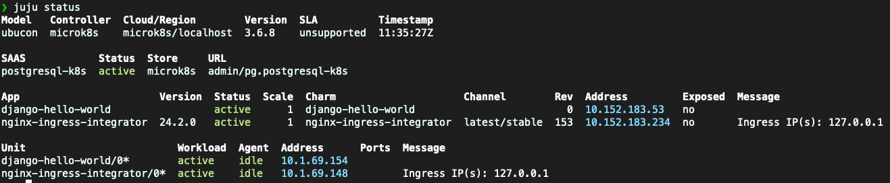

# 🚀 12-Factor 애플리케이션을 선택하여 끝까지 배포하기!

<p align="center">
  
</p>

\*다른 언어로 읽기: [English](README.md), [한국어](README.ko.md)

이 리포지토리는 "선택한 12-factor 애플리케이션을 끝까지 배포하기!" 세미나의 시작점입니다. 원하는 프레임워크를 선택하고 환경에 배포하세요.
세미나의 각 단계는 이 리포지토리의 브랜치로 되어 있으니, 모든 단계를 수행할 시간이 없더라도 걱정하지 마세요!

## 🌱 시작하는 방법

1. 이 리포지토리를 복제합니다.

   ```bash
   git clone https://github.com/canonical/paas-charm-workshop.git
   ```

2. 다음 프레임워크 중 하나를 선택합니다:

- [Django](https://github.com/yanksyoon/hello-ubucon/tree/django) (`git checkout django`)
- [ExpressJS](https://github.com/yanksyoon/hello-ubucon/tree/expressjs) (`git checkout expressjs`)
- [FastAPI](https://github.com/yanksyoon/hello-ubucon/tree/fastapi) (`git checkout fastapi`)
- [Flask](https://github.com/yanksyoon/hello-ubucon/tree/flask) (`git checkout flask`)
- [Go](https://github.com/yanksyoon/hello-ubucon/tree/go) (`git checkout go`)
- Spring Boot

3. 선택한 프레임워크의 브랜치로 전환합니다 (예: `git checkout django`)

4. `README.md`의 지침을 따릅니다!

## 👨🏻‍💻 이 세미나가 끝나면

- 선택한 12-factor 애플리케이션을 끝까지 배포할 수 있습니다!
  - 애플리케이션 OCI 이미지를 생성하고 저장소에 올립니다.
  - 애플리케이션을 Juju + Microk8s 환경에 배포합니다.

## 📝 필수 조건

세미나를 위해 필요한 스냅은 다음과 같습니다.

- [Rockcraft](https://snapcraft.io/rockcraft)
- [Charmcraft](https://snapcraft.io/charmcraft)
- [Juju](https://snapcraft.io/juju)
- [LXD](https://snapcraft.io/lxd)
