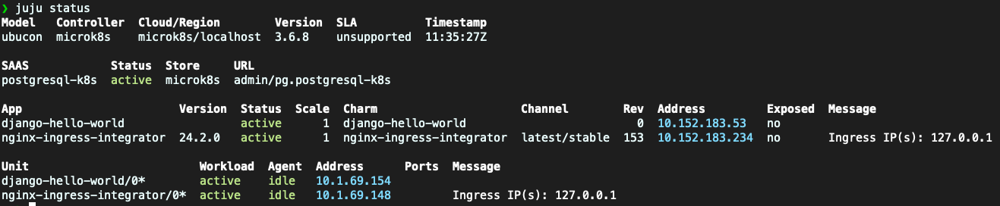

# 🚀 Deploy a 12-factor application of your choice end-to-end!

<p align="center">
  
</p>

\*Read this in other languages: [English](README.md), [한국어](README.ko.md)

This repository is the starting point of the seminar "Deploy a 12-factor application of your
choice end-to-end!". Choose a framework of your choice and deploy it to an environment. Each step
of the seminar is a branch in this repository, so don't worry if you don't have time for all steps.

## 🌱 How to start

1. Clone this repository

```bash
git clone https://github.com/canonical/paas-charm-workshop.git
```

2. Choose one of the following frameworks:

- [Django](https://github.com/yanksyoon/hello-ubucon/tree/django) (`git checkout django`)
- [ExpressJS](https://github.com/yanksyoon/hello-ubucon/tree/expressjs) (`git checkout expressjs`)
- [FastAPI](https://github.com/yanksyoon/hello-ubucon/tree/fastapi) (`git checkout fastapi`)
- [Flask](https://github.com/yanksyoon/hello-ubucon/tree/flask) (`git checkout flask`)
- [Go](https://github.com/yanksyoon/hello-ubucon/tree/go) (`git checkout go`)
- Spring Boot

3. Switch the branch to the framework you chose (e.g., `git checkout django`)
4. Follow the instructions in the `README.md`!

## 👨🏻‍💻 Intended outcomes

- You should be able to deploy a 12-factor application of your choice end-to-end! This means that:
  - The application OCI image is created and pushed to a repository.
  - The application is deployed to a Juju + Microk8s environment.

## 📝 Prerequisites

The following snaps are required for the tutorial.

- [Rockcraft](https://snapcraft.io/rockcraft)
- [Charmcraft](https://snapcraft.io/charmcraft)
- [Juju](https://snapcraft.io/juju)
- [LXD](https://snapcraft.io/lxd)
